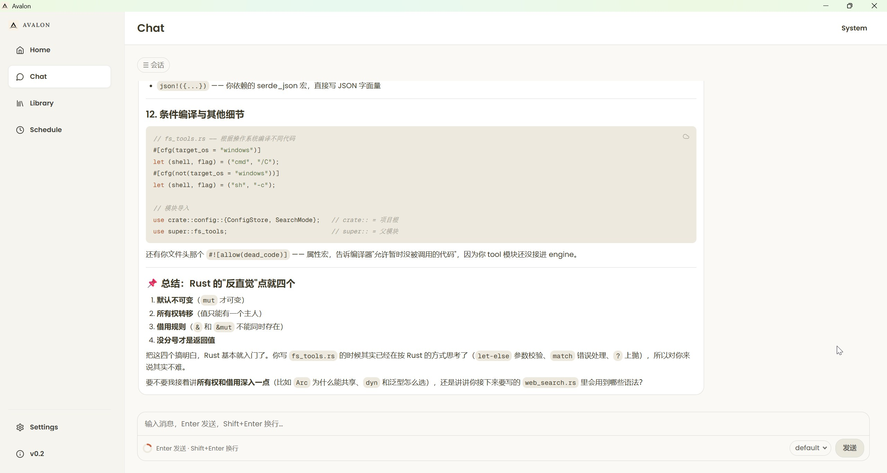
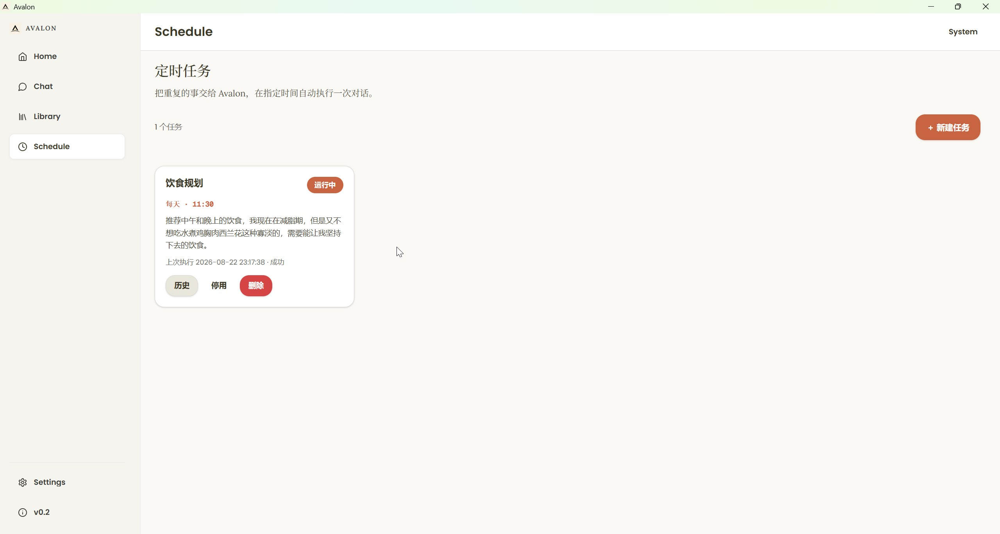
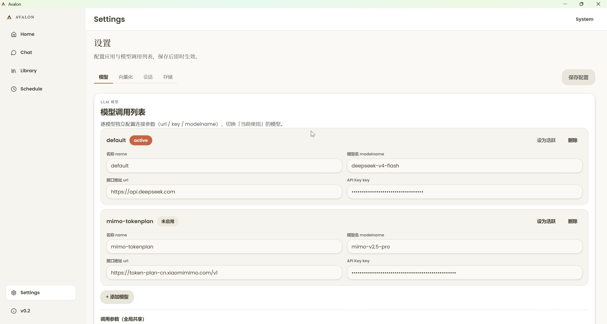

# Avalon

> 面向个人的轻量智能助手 —— 人性化、低门槛、交互友好。

A lightweight personal intelligent assistant focused on individuals, humanized, low-threshold, and interaction-friendly.


## 简介

Avalon 是一个运行在本地的 AI 个人助手，采用 **Tauri 2（Rust 后端 + React 前端）** 构建。它具备多轮对话、会话记忆、定时任务三大核心能力，并内置本地向量化模型（embedding），无需额外部署服务即可开箱即用。

## ✨ 功能特性

- **多轮对话**：基于 ReAct 双层循环引擎，流式输出，支持工具调用与中间动作可视化。
- **会话记忆**：自动压缩 + 渐进式总结 + 向量检索（semantic / keyword / hybrid 三模式），长对话不丢上下文。
- **会话管理**：多会话切换、归档、重命名、删除，历史按需渐进式加载。
- **Markdown 渲染**：支持 GFM、代码高亮。
- **定时任务**：让对话自动定时运行（once / daily / weekly），执行历史可继续追问，未读角标提醒。
- **多模型配置**：模型列表增删改、活跃模型一键切换，各模型独立鉴权。
- **本地 embedding**：内置 candle `bge-small-zh-v1.5`，向量化零 API 成本。
- **用量统计**：token 按「天 × 模型」聚合。

## 📸 界面预览

### Chat · 对话



### Schedule · 定时任务



### Settings · 设置



## 🧱 技术栈

| 层 | 技术 |
|---|---|
| 桌面框架 | [Tauri 2](https://tauri.app) |
| 后端 | Rust（tokio · reqwest · candle · serde · chrono） |
| 前端 | React 19 · TypeScript · Vite |
| UI | Ant Design 6 · react-markdown · @xyflow/react |

## 🚀 快速开始

### 环境要求

- **Node.js** ≥ 18（含 npm）
- **Rust**（stable toolchain）
- **Windows**：WebView2（Win10/11 系统自带）

### 开发运行

```bash
cd Avalon-tauri
npm install
npm run tauri dev
```

首次启动会自动在 `Avalon-tauri/` 下生成 `Avalon-config.toml`，在其中填入 LLM 的 API Key 即可对话（默认示例为 DeepSeek，支持任意 OpenAI 兼容接口）。

### 打包桌面安装包

```bash
cd Avalon-tauri
npx tauri build
```

产物：`src-tauri/target/release/bundle/nsis/Avalon_0.2.0_x64-setup.exe`（Windows 安装包，双击安装，默认装到当前用户目录，无需管理员权限）。

## 📁 仓库结构

```
Avalon/
├── Avalon-tauri/        ← 当前主力版本（Tauri 2 桌面应用）✅ 推荐
├── Avalon-python/       ← 早期飞书机器人版本（agent + server）⚠️ 已停止维护
├── Avalon-web/          ← 早期 Vue 3 Web 版本 ⚠️ 已停止维护
├── doc/                 ← 开发设计文档（v0.1 / v0.2 各模块）
└── assets/              ← 界面截图等静态资源
```

> ⚠️ **版本说明**：`Avalon-python/`（飞书机器人）与 `Avalon-web/`（Vue 3 Web 前端）为早期原型，功能已落后且不再维护。请使用最新的 **`Avalon-tauri/`** 版本。

## 📄 License

本项目基于 [MIT License](LICENSE) 开源。

- **允许**：自由使用、复制、修改、合并、发布、分发、再许可和/或销售本软件（含商业用途）。
- **条件**：在使用或分发时，必须保留上述版权声明和本许可声明（即标明来源）。
- **免责**：本软件按「现状」提供，不附带任何明示或暗示的担保。
